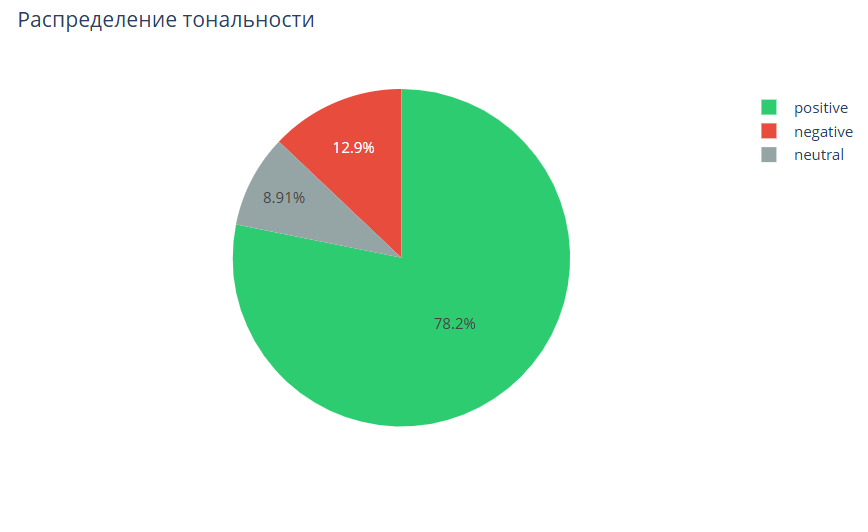
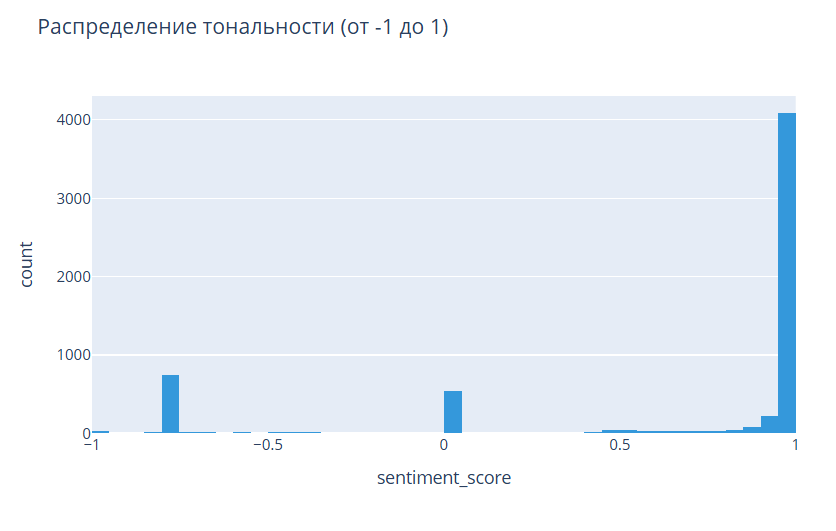
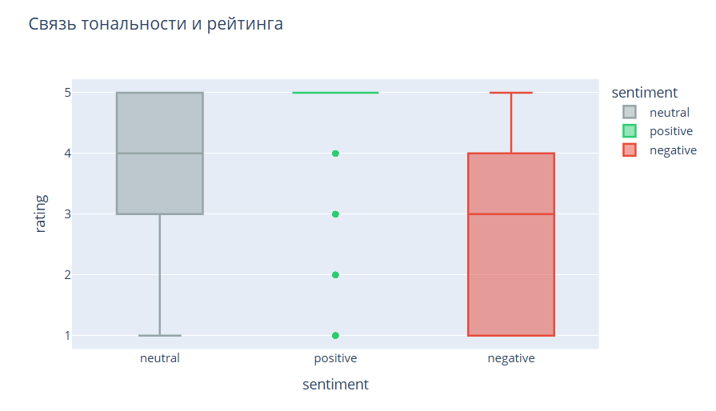
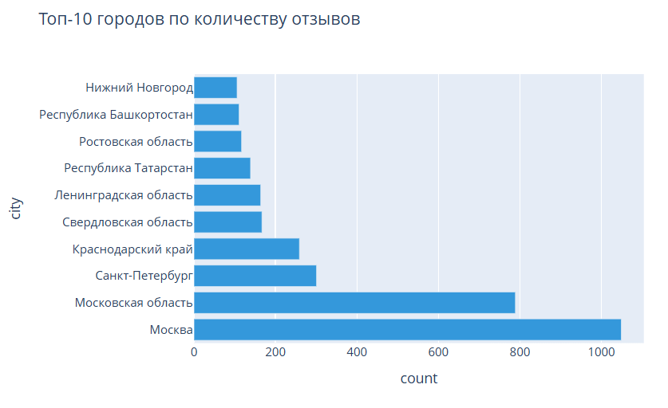

# Анализ тональности отзывов Пятёрочка

## О проекте

Интерактивный дашборд для анализа тональности отзывов о магазинах "Пятёрочка" на основе данных с Яндекс Карт. Проект позволяет визуализировать распределение тональности, исследовать связь с рейтингами и анализировать географию отзывов.

**Данные:** 6 042 отзыва
**Период:** 2023 год  
**Источник:** датасет Яндекса на kaggle: https://www.kaggle.com/datasets/kyakovlev/yandex-geo-reviews-dataset-2023?select=geo-reviews-dataset-2023.csv

---

## Технологии

| Компонент | Технология |
|-----------|------------|
| **Язык программирования** | Python |
| **Обработка данных** | Pandas |
| **Анализ тональности** | RuBERT (blanchefort/rubert-base-cased-sentiment) |
| **Визуализация** | Plotly |
| **Дашборд** | Dash |
| **Числовые вычисления** | NumPy |
| **Среда разработки** | VS Code, Google Colab |

---

## Этапы работы

### 1. Получение данных
- Загружен датасет Яндекса с 500 000 отзывов
- Отфильтрованы отзывы по ключевому слову "Пятёрочка" (6 042 отзыва)
- Добавлена колонка с городом на основе адреса

### 2. Анализ тональности (Sentiment Analysis)
- Использована модель **RuBERT** (blanchefort/rubert-base-cased-sentiment)
- Каждому отзыву присвоена оценка тональности в диапазоне от -1 до 1
- Категоризация: positive (>0.2), neutral (-0.2 до 0.2), negative (<-0.2)

### 3. Разработка дашборда
- Создано интерактивное приложение на Dash
- Реализованы фильтры по городу и рейтингу
- Построены 4 типа визуализаций

---

## Описание графиков

### 1. Круговая диаграмма (Pie Chart)

Показывает долю позитивных, нейтральных и негативных отзывов в общем объеме.



**Цветовая схема:**
- **Зеленый** — позитивные отзывы
- **Серый** — нейтральные отзывы
- **Красный** — негативные отзывы

**Вывод:**
> 78% положительных отзывов - это хороший показатель, большинство покупателей довольны. 13% негативных отзывов говорит о наличии проблем, поскольку сеть "Пятерочка" - одна из самых популярных продуктовых сетей в России и имеет тысячи магазинов, то 13% - достаточно высокий показатель: каждый 8 отзыв негативный (1/0.129). Было бы хорошо снизить долю негативных отзывов.

---

### 2. Гистограмма

Показывает как распределяются значения тональности от -1 до 1.



**Оси:**
- **X (горизонтальная)** — значение оценки тональности (от -1 до 1)
- **Y (вертикальная)** — количество отзывов

**Вывод:**
> Гистограмма показывает, что негативные отзывы образуют узкий пик в районе -0.8. Это говорит об однородности негативных отзывов: вероятнее всего, пользователи пишут об одних и тех же проблемах, используя схожую лексику (просрочка, очереди, грубость). 
Позитивные же отзывы распределены в диапазоне от 0.5 до 1.0, что говорит о разнообразии причин для того, чтобы отметить положительные стороны сети.
---

### 3. Boxplot

Показывает как числовой рейтинг, который указали пользователи в отзыве, соотносится с тональностью текста.



**Проверяет:**
- Корректность работы модели тональности
- Необычные паттерны (негативный текст с высоким рейтингом)

**Вывод:**
> Boxplot подтверждает, что модель работает корректно: позитивным отзывам соответствуют высокие оценки (медиана 5), негативным — низкие (медиана 3), нейтральным - средние (медиана 4). Однако присутствуют выбросы: для положительных отзывов есть отзыв с оценкой 1, для отрицательных - отзывы с оценкой 5.

---

### 4. Bar Chart

Показывает В каких городах больше всего отзывов о Пятёрочке.



> Москва и Санкт-Петербург ожидаемо лидируют по количеству отзывов.

---

## Функциональность дашборда

### Фильтры

**1. Выбор города**
- Все города (по умолчанию)
- Любой конкретный город из списка

**2. Диапазон рейтинга**
- Слайдер от 1 до 5 с шагом 0.5
- Позволяет анализировать отдельно:
  - Довольных клиентов (рейтинг 4-5)
  - Недовольных клиентов (рейтинг 1-2)
  - Нейтральных клиентов (рейтинг 3)

---

## Запуск проекта

### Требования
- Python 3.8+

### Установка

```bash
# Клонировать репозиторий
git clone https://github.com/IRinaN0V1/Pyaterochka-Review-Analysis-Dashboard.git
cd Pyaterochka-Review-Analysis-Dashboard

# Создать виртуальное окружение
python -m venv venv

# Активировать (Windows)
venv\Scripts\activate

# Установить зависимости
pip install -r requirements.txt

# Запустить приложение
python app.py
